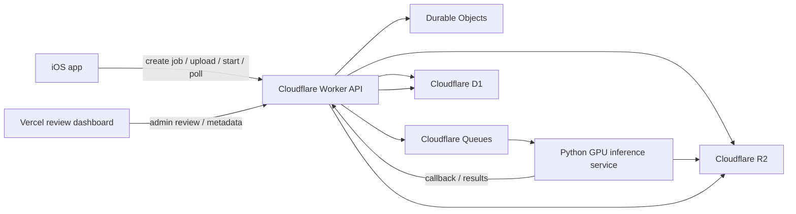

# Architecture

## Target Flow

## Rules

- The Worker is the public control plane.
- R2 stores uploads, manifests, artifacts, and evaluation assets.
- One Durable Object owns the authoritative state for one job.
- D1 is the searchable secondary index for jobs, clips, reviews, and metadata.
- Queues only orchestrate work; they do not run FFmpeg or inference.
- The GPU service performs file download, FFmpeg extraction, candidate proposal, recognition, reranking, and result packaging.
- Vercel is only for review/admin UX and optional metadata generation.

## Contract

- Preserve the current iOS job lifecycle: `create -> upload -> start -> poll -> delete`.
- Keep the cloud contract additive.
- Add `requestId`, `jobId`, `confidence`, `modelVersion`, and `failureReason` where relevant.

