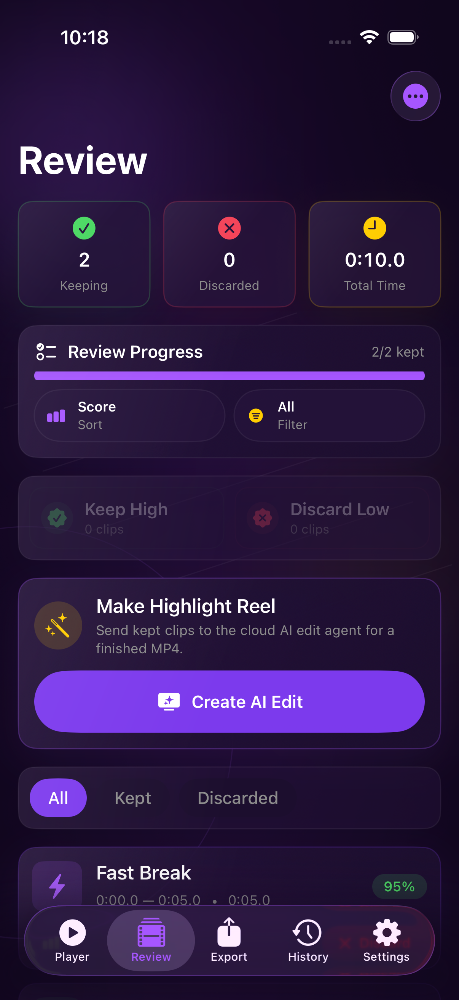
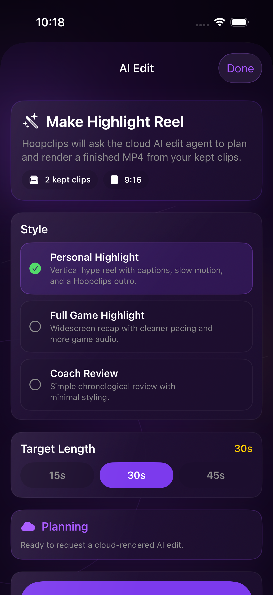
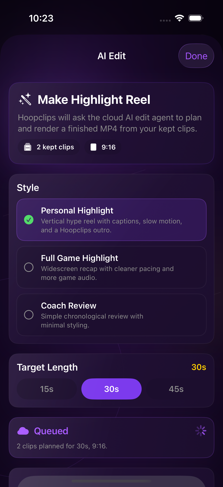
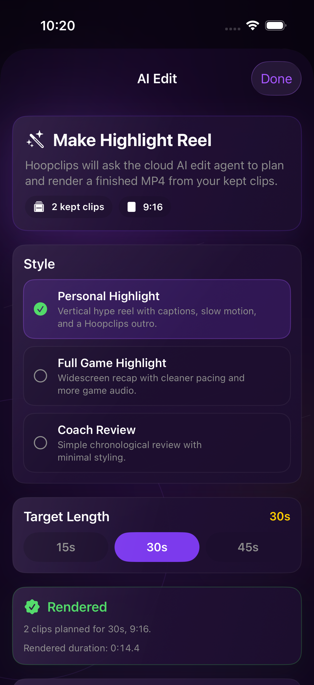
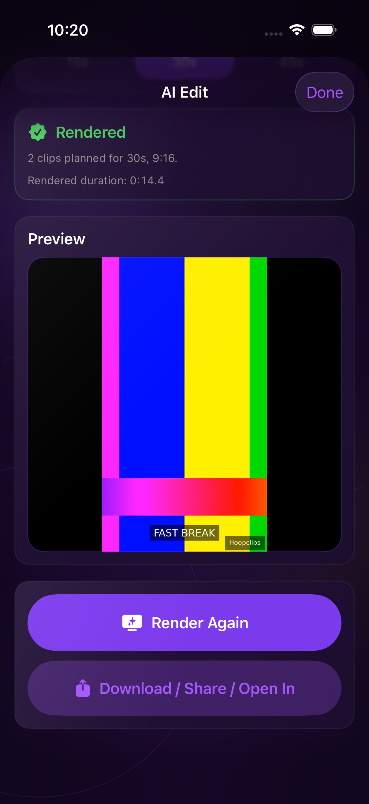

# Phase Edit3d Live UI Smoke Evidence

Date: April 28, 2026

Branch: `codex/phase-edit3d-live-ui-smoke-evidence`

## Summary

The existing DEBUG UI smoke harness successfully proved the live iOS AI Edit path from the Review fixture through cloud render completion, native preview, and system share sheet.

Proof chain:

```text
Review fixture
-> Make Highlight Reel
-> Personal Highlight, 30s
-> live cloud render request
-> render status reaches rendered
-> MP4 preview appears
-> Share/Open In sheet appears
```

The passing run used the active staging Worker URL configured by the harness:

```text
https://hoopsclips-control-plane-staging.charliehan-lifepage.workers.dev
```

No full presigned download URLs were logged.

## Environment

- Simulator: iPhone 17
- Simulator UDID: `A46E2157-77ED-42CE-959D-65C068681A47`
- Runtime: iOS 26.0.1
- Result bundle for the passing live UI smoke:
  `/tmp/hoopsclips-phase-edit3d-live-ui-20260428-101557.xcresult`
- Result bundle for the supplemental render-status capture:
  `/tmp/hoopsclips-phase-edit3d-live-ui-with-status-20260428-102303.xcresult`

## Commands

Simulator stabilization:

```bash
xcrun simctl shutdown all
xcrun simctl erase all
xcrun simctl boot A46E2157-77ED-42CE-959D-65C068681A47
xcrun simctl bootstatus A46E2157-77ED-42CE-959D-65C068681A47 -b
```

Build validation:

```bash
git diff --check
xcodebuild -project ios/HoopsClips.xcodeproj -scheme HoopsClips -configuration Debug -destination 'generic/platform=iOS Simulator' build CODE_SIGNING_ALLOWED=NO
xcodebuild -project ios/HoopsClips.xcodeproj -scheme HoopsClips -configuration Debug -destination 'generic/platform=iOS Simulator' build-for-testing CODE_SIGNING_ALLOWED=NO
```

Focused live UI smoke:

```bash
xcodebuild test \
  -project ios/HoopsClips.xcodeproj \
  -scheme HoopsClips \
  -configuration Debug \
  -destination "platform=iOS Simulator,id=A46E2157-77ED-42CE-959D-65C068681A47" \
  -only-testing:HoopsClipsUITests/HoopsClipsUITests/testLiveAIEditClientSmokeFlow \
  -parallel-testing-enabled NO \
  -derivedDataPath /tmp/hoopsclips-phase-edit3d-live-ui-derived \
  -resultBundlePath /tmp/hoopsclips-phase-edit3d-live-ui-20260428-101557.xcresult \
  OTHER_SWIFT_FLAGS='$(inherited) -D HOOPS_ENABLE_UI_SMOKE' \
  CODE_SIGNING_ALLOWED=NO
```

## Validation Results

- `git diff --check`: passed
- Debug simulator build: passed
- Debug `build-for-testing`: passed
- Focused live UI smoke: passed
- Live UI smoke result: `1` test passed, `0` failed, `0` skipped

The focused UI smoke confirmed:

- Review fixture appeared.
- `Make Highlight Reel` was visible and tappable.
- `Personal Highlight` style was visible.
- `30s` target duration was selected.
- Render was requested through the live UI.
- Render status reached `rendered`.
- Native MP4 preview appeared.
- System share sheet opened with the downloaded MP4 handoff.

## Evidence

Review fixture:



Style picker:



Render status:



Rendered MP4 preview:



System share sheet:



## Run Notes

The canonical passing result bundle captured Review, style picker, rendered preview, and share sheet screenshots. A supplemental follow-up run captured the in-progress render-status screenshot while the UI was in the `Queued` state. That follow-up run later ended with an XCTest runner signal-kill before preview/share, so it is not counted as the passing proof run.

The passing proof remains the first focused live UI smoke result:

```text
result: Passed
passedTests: 1
failedTests: 0
skippedTests: 0
```

The smoke harness does not currently surface `editJobId`, `renderJobId`, final object key, or render log key to XCTest logs. Those values were therefore not recorded here. No full presigned download URL was logged.

## Safety Checks

- No backend/rendering code was changed.
- No iOS video rendering or local composition was introduced.
- The iOS path remains preview/download/share only.
- The share path uses the system share sheet for the downloaded MP4 handoff, not raw presigned URL sharing.
- Unrelated root Xcode project folders were left untouched.
