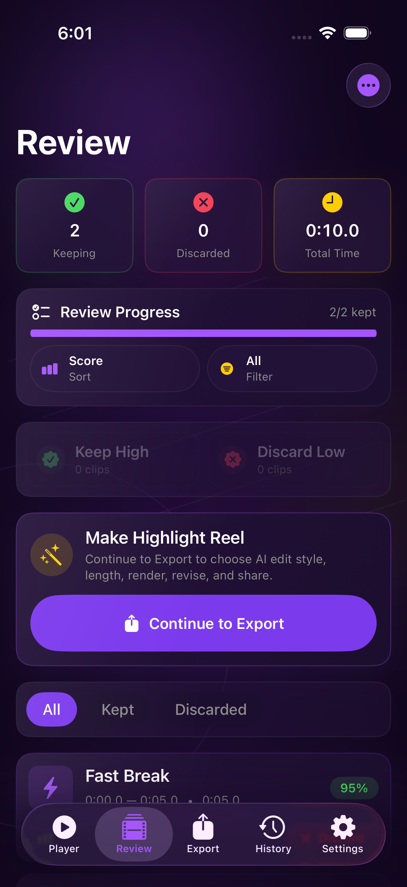
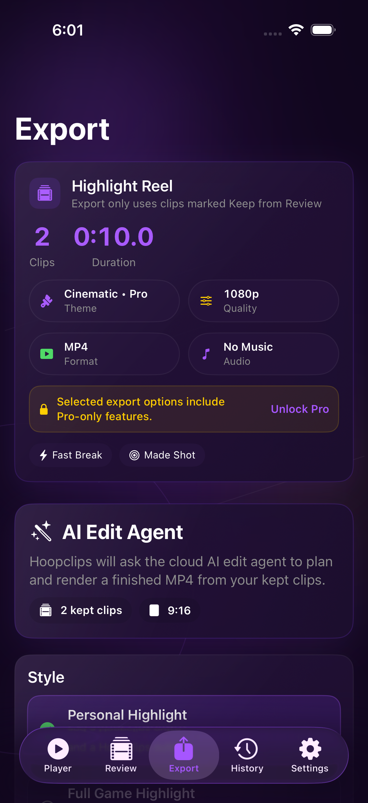
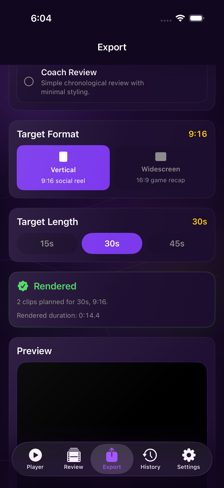
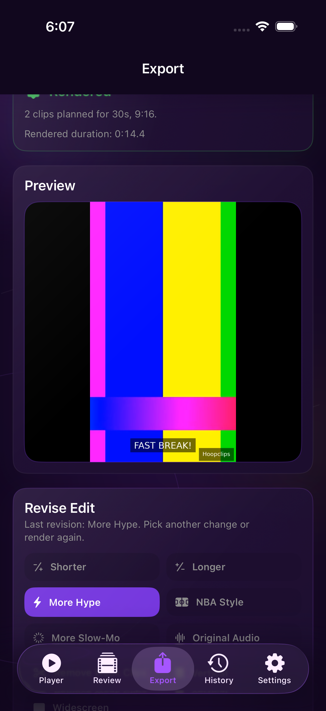
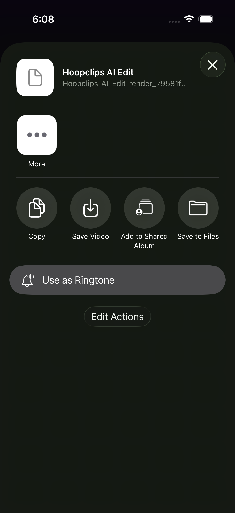

# Phase Edit4c Live Export Page Smoke

## Verdict

The corrected Export-page AI Edit Agent flow is proven live in staging:

```text
Review -> Export -> AI Edit Agent -> cloud render -> preview -> revision -> revised render -> share/open-in
```

The iOS app remained a client surface only. No local video rendering or AVFoundation composition/export pipeline was introduced.

## Branch

```text
branch: codex/phase-edit4c-live-export-page-smoke
base commit: 3d20c694ccb9103dda2247d359dd2292a315a136
```

## Build Validation

Passed:

```text
git diff --check
xcodebuild -project ios/HoopsClips.xcodeproj -scheme HoopsClips -configuration Debug -destination 'generic/platform=iOS Simulator' build CODE_SIGNING_ALLOWED=NO
xcodebuild -project ios/HoopsClips.xcodeproj -scheme HoopsClips -configuration Debug -destination 'generic/platform=iOS Simulator' build-for-testing CODE_SIGNING_ALLOWED=NO
npm run typecheck # services/control-plane
```

The final live UI smoke also rebuilt the app and UI test target as part of:

```text
xcodebuild -project ios/HoopsClips.xcodeproj -scheme HoopsClips -configuration Debug -destination 'id=A46E2157-77ED-42CE-959D-65C068681A47' -only-testing:HoopsClipsUITests/HoopsClipsUITests/testLiveAIEditClientSmokeFlow test CODE_SIGNING_ALLOWED=NO OTHER_SWIFT_FLAGS='$(inherited) -D HOOPS_ENABLE_UI_SMOKE' -resultBundlePath docs/phase_edit4c_artifacts/Test-HoopsClips-phase4c-postdeploy.xcresult
```

Final UI smoke result:

```text
TEST SUCCEEDED
testLiveAIEditClientSmokeFlow: passed
duration: 425.229 seconds
device: iPhone 17, iOS 26.0.1, A46E2157-77ED-42CE-959D-65C068681A47
```

## Deployment Fixes During Smoke

The first live Export-page run proved initial cloud render and MP4 preview, but revision failed with:

```text
failureReason: Route not found.
```

Route probes showed two stale deployed layers:

1. The active staging Worker did not yet recognize `/v1/edit-jobs/{id}/revise`.
2. After redeploying the Worker, the editing service returned FastAPI `detail: Not Found`, proving the Cloud Run service also needed the phase-edit4 revision routes.

Resolved by redeploying staging services from the current branch without changing backend source code:

```text
worker: hoopsclips-control-plane-staging
worker url: https://hoopsclips-control-plane-staging.charliehan-lifepage.workers.dev
worker version: efec3062-e921-469c-92f0-766d36a58898

editing service: hoopclips-editing-staging
editing url: https://hoopclips-editing-staging-npya43jiia-uc.a.run.app
editing revision: hoopclips-editing-staging-00004-9ks
editing gitSha: 3d20c69
cloud build id: dfa95faf-877d-4d68-9638-96cfd35f1eec
```

Post-deploy revision route probe now reaches the editing service:

```text
POST /v1/edit-jobs/edit_fake_probe/revise
404 edit_job_not_found
```

That is the expected response for a fake edit job and confirms the route exists through the active Worker path.

## Smoke Steps Proven

The final green run verified:

1. Review fixture appears.
2. Review routes to Export.
3. Export page shows the AI Edit Agent section.
4. Personal Highlight style is selectable.
5. 30s target length is selectable.
6. Vertical format is selectable.
7. Generate Highlight Reel sends a cloud request.
8. Render status reaches rendered.
9. MP4 preview appears.
10. More Hype revision command can be requested.
11. Render Revision creates a revised cloud render.
12. Revised MP4 preview appears.
13. Share/Open In opens the system share sheet with the downloaded MP4.

## Evidence












## Backend IDs

The UI smoke harness does not currently surface edit/render/revision object IDs in XCTest attachments. The final run proved the user-visible path by state transitions and screenshots, but exact IDs were not captured:

```text
editJobId: not exposed by current UI smoke harness
renderJobId: not exposed by current UI smoke harness
revisionId: not exposed by current UI smoke harness
revisedRenderJobId: not exposed by current UI smoke harness
final object key: not exposed by current UI smoke harness
revised final object key: not exposed by current UI smoke harness
```

No full presigned download URLs were logged.

## UI Harness Fixes

Three small smoke-hardening fixes were needed:

- Moved `export.aiEdit.section` and `export.aiEdit.revision.card` identifiers from broad containers onto narrow title labels so child `export.aiEdit.*` controls stay visible in the accessibility tree.
- Updated `tapWhenReady` to scroll while waiting for lazy/offscreen Export controls to exist before checking hittability.
- Made render-status polling tolerate a short initial `render_job_not_found` window so the client can survive a render request being accepted before the backing job record is immediately readable.

## Remaining Notes

- The Cloud Run deploy step still warns that the unauthenticated invoker IAM binding may need manual reapplication, but the service is live and serving the final smoke path after deploy.
- CI/automation still needs a dedicated `CLOUDFLARE_API_TOKEN`; this run used local Wrangler OAuth.
- Root-level untracked Xcode `Package.resolved` files were intentionally left untouched.
